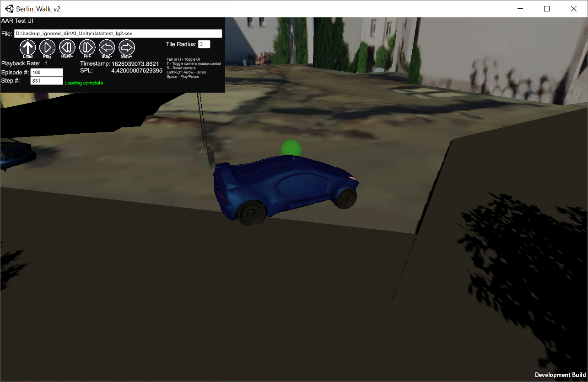

# AAR Module Instructions

Instruction on how to use the ARORA AAR mode
The AAR mode uses the vector observation files created by the navsim environment. Ensure that you execute navsim with the –save_vector_obs, this will store a file called vec_obs.csv
1. Execute the berlin executable, currently with the release name AAR in the release. Use the -playback switch
   
   
2. Type in the full path to the filename into the text input field. Either type a return at the end, or click the load icon. 
3. See the UI guidelines for further details. 

UI Guidelines

    1. The full path to the observation file should be entered in this field. 
    2. Loads the observation file listed in 1. This should only be done once. 
    3. Play – plays the episode in 7, at the rate specified by the playback rate
    4. Rewind+, reduces the playback speed by 1x. 
    5. FF+, reduces the playback speed by 1x. 
    6. Increase or decrease the agent step by a single step.
    7. Jump to an episode number, or step number. Jumping to a new episode number will cause the local scene to be (re)loaded. 
    8. Keystoke legend:
      T- Toggles mouse controls  for the viewpoint.
      R- Resets the camera to a relative location.
      L/R Arrow Key- Scrub the scene forward or backward.
      Space Bar- Pause or Resume the AAR replay.
      Tab/H Key- Hides or reveals this UI.
    9. Tile radius- potentially provides improvement in performance or provides increased environment visibility depending on the terrain tile radius entered.
  
   